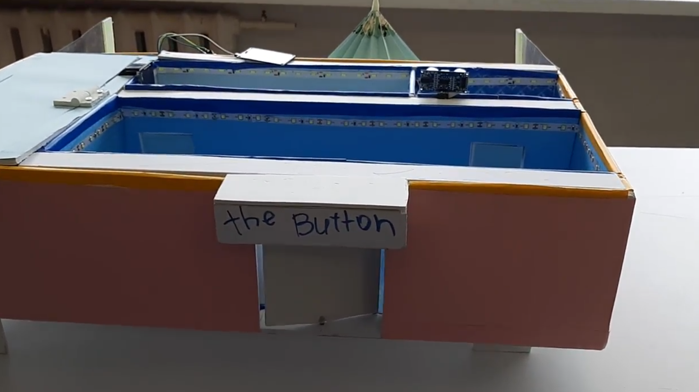
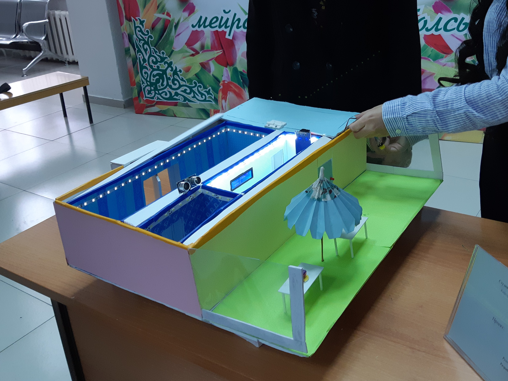
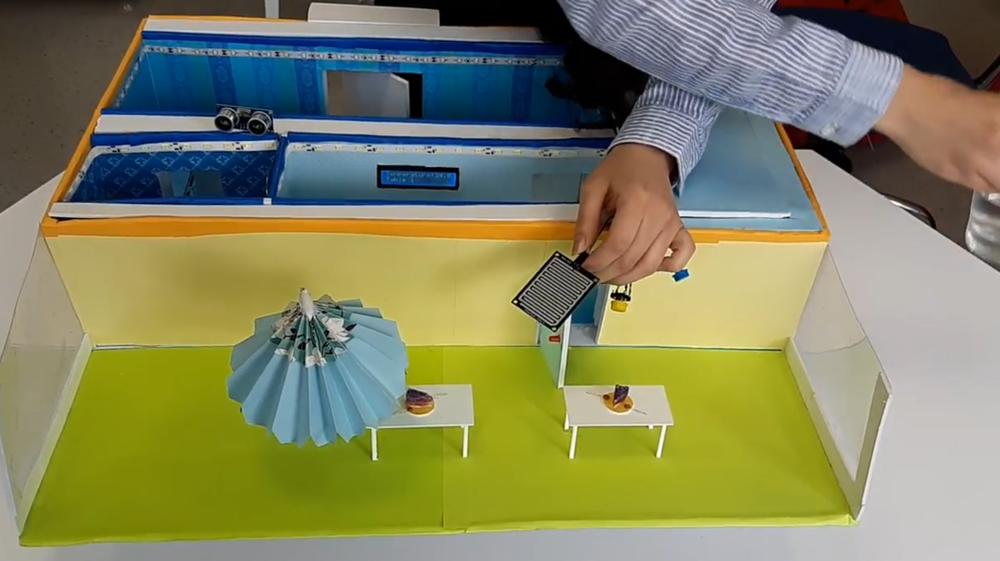
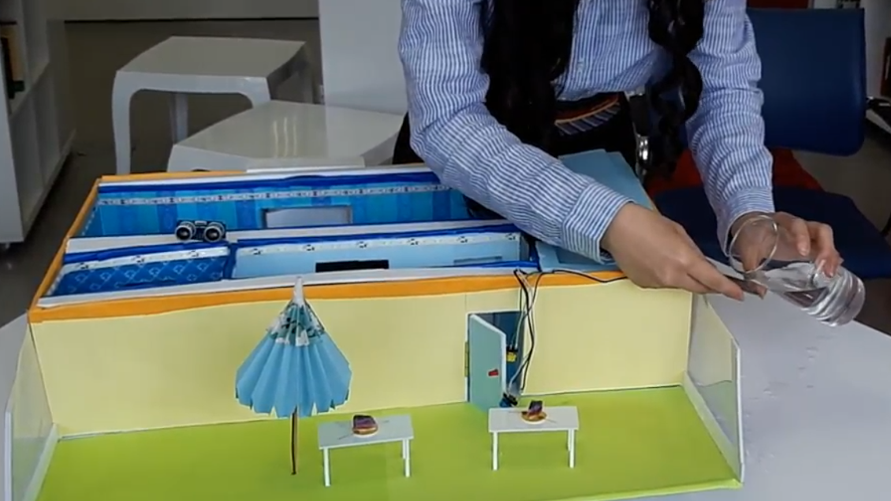
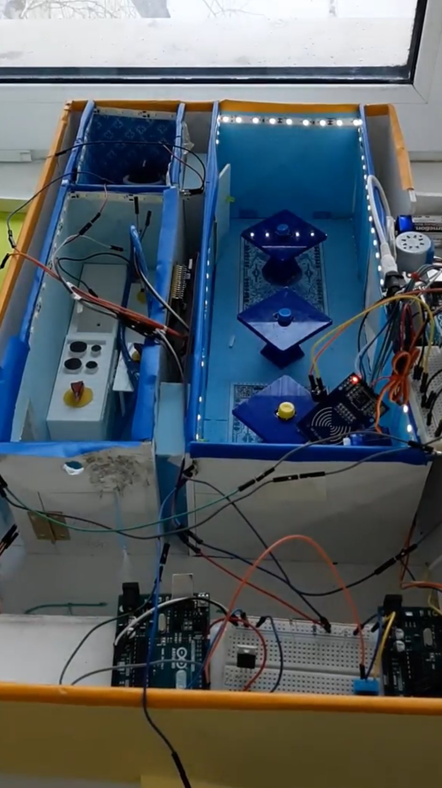

# SMART RESTAURANT
<b>Description:</b>
Miniature prototype that demonstrates IoT feature incorporated in restaurant, such as contactless menu and ordering, rain protection, automatic light and doors.

<b>Used technologies:</b> 
Arduino, Autodesk 123D Design (3D modeling), Ultimaker (3D printing)

**Features:**
- Contactless menu and ordering

Tables have buttons that send signals to a display in the kitchen that prints the table’s number. This simulated the idea of clients using tablets to send their orders directly to the kitchen. Tables are 3D modeled and printed especially to match buttons.
- Rain protection

The restaurant has a terrace with umbrellas that open if there is a possibility of rain. This feature is implemented by using humidity sensor, servo motor and special paper folding technique - for umbrellas to open up.
- Sensor light

In the restroom, the light (diode tape) automatically turns on if the ultrasonic sensor detects motion in the room.
- Sensor door

Rotating door stops the motion when there are people incoming; it is implemented with ultrasonic sensor and motor.

